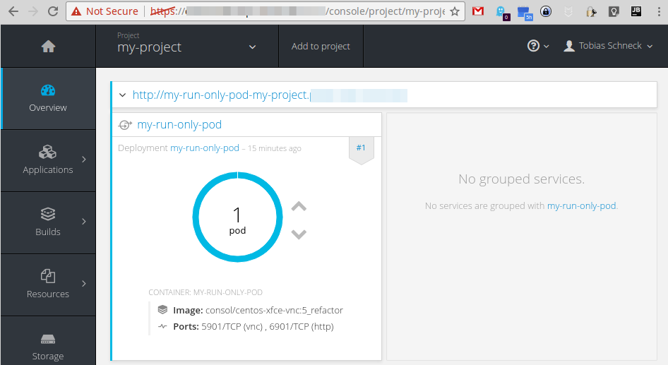
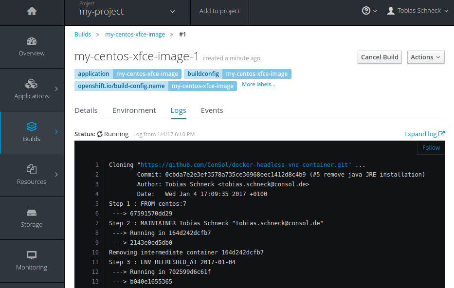
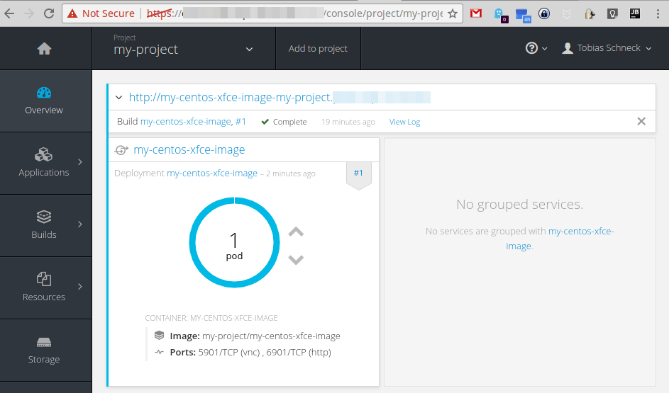

# OpenShift usage of "headless" VNC Docker images

The following content uses as example the image `consol/centos-xfce-vnc` of the Dockerfile `Dockerfile.centos.xfce.vnc`.

## Run the image from Dockerhub
                                
    cd openshift                
    oc new-project my-project   

As soon as you are logged in and selected your oc project, you can simple run the image by using the configuration `openshift.headless-vnc.run.yaml`:

    oc process -f openshift.headless-vnc.run.yaml -v APPLICATION_NAME=myrunonlypod IMAGE=consol/centos-xfce-vnc | oc create -f -
    # service "my-run-only-pod" created
    # route "my-run-only-pod" created
    # imagestream "my-run-only-pod" created
    # deploymentconfig "my-run-only-pod" created

After the deployment you will see at your management UI the new deployed service ``:

[https://__YOUR-OS-MANAGEMENT-URL__/console/project/my-project/overview]() 

Over the URL you can look and control the fresh deployed container via the web-vnc interface:
 
[http://my-run-only-pod-my-project.__YOUR-OS-URL__/?password=vncpassword]() 
 

 
## Build & Run your own image

If you want to build the image in your own infrastructure just use the configuration `openshift.headless-vnc.buildandrun.yaml`:

    oc process -f openshift.headless-vnc.buildandrun.yaml -v APPLICATION_NAME=my-centos-xfce-image,SOURCE_DOCKERFILE=Dockerfile.centos.xfce,SOURCE_REPOSITORY_REF=master | oc create -f -
    # service "my-centos-xfce-image" created
    # route "my-centos-xfce-image" created
    # imagestream "my-centos-xfce-image" created
    # buildconfig "my-centos-xfce-image" created
    # deploymentconfig "my-centos-xfce-image" created

Now a fresh image build will be triggerd, see:

[https://__YOUR-OS-MANAGEMENT-URL__/console/project/my-project/browse/builds/my-centos-xfce-image/my-centos-xfce-image-1?tab=logs]()

After the image is successfully built, openshift will autmaticly will deploy it as new service:

[https://__YOUR-OS-MANAGEMENT-URL__/console/project/my-project/overview]() 

After the deployment, you you can look and control the fresh deployed container via the web-vnc interface:
 
[http://my-centos-xfce-image.__YOUR-OS-URL__/?password=vncpassword]() 
 
** or open an [issue](https://github.com/ConSol/docker-headless-vnc-container/issues/new).

The guys behind:

**ConSol Software GmbH**  
*Franziskanerstr. 38, D-81669 München*  
*Tel. +49-89-45841-100, Fax +49-89-45841-111* 
*Homepage: http://www.consol.de E-Mail: [info@consol.de](info@consol.de)*
